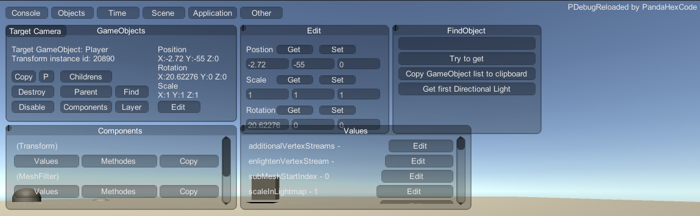
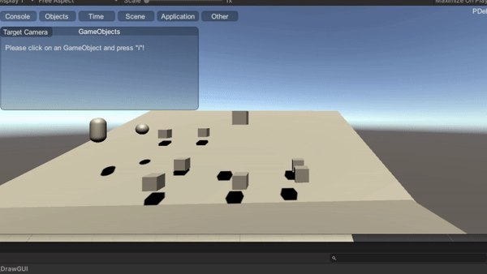
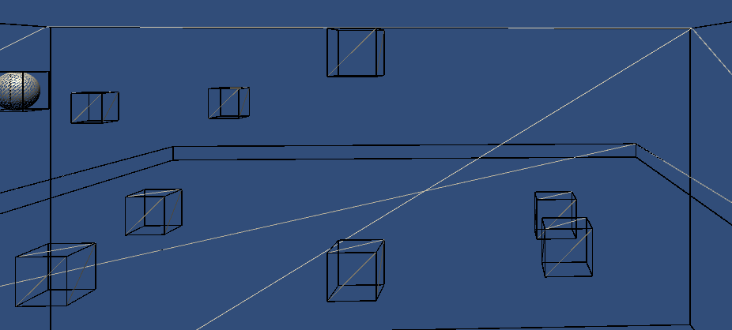

# PDebugReloaded Unity Game Cheat/Hack Script
PDebug is a script for Unity (written in C#) that allows users to debug the game, it's also nice for cheating in other games.



## Why PDebug"Reloaded"?
PDebugReloaded is a completely revised version of my old project "PDebug", I improved the code, beautified, added new functions etc.

## Ingame Console
Of course there is also an ingame console where the user can see all logs/warnings/erros!

## Edit an GameObject ingame
You can edit GameObjects ingame like deactivate/activate it, destroy it , copy it , change the position, rotation & scale, deactivate/activate individual components,
and more...



## Invoke Methods
You can invoke a Methode for any Component you want and edit the Parameters of it (Currently not supported all Parameters)!

## Change Values ingame
You can change Values from any Component

## Ingame Time Controll
In the "Time" tab you can view the deltaTime and timeScale, and you can also change the timeScale as you like to speed up or slow down the game.

## Scene
In the "Scene" tab you will see a list of all the scenes and next to it a "Load" button with which you can load the selected scene!

## Render
In the "Other" Tab you can enable the FreeCam.
Enable wireframe.
Enable DrawCollisions.



# Change Physics Settings
For having fun you can change the Physics settings ingame like gravity etc (You can open the menu from the Other Tab)

## And much more

## Is3D Boolean
Don't forget to set the is3D bool correctly in the script or ingame in the Application Tab!

## Easy to implement
The script was only written with GUI, which means that it does not need any external variables that have to be specified in the editor, it simply has to be added to an object!

With the program dnSpy (https://github.com/dnSpy/dnSpy) you can add the script to a compiled Unity game, but you have to add the script to a GameObject somewhere, which should be easy ("```Camera.main.gameObject.AddComponent<PandaHexCode.PDebug.PDebugReloaded>();```"), just write it somewhere in like "MainMenu.cs", "TitleScreen.cs", "SplashScreenController.cs" Awake or Start function!
